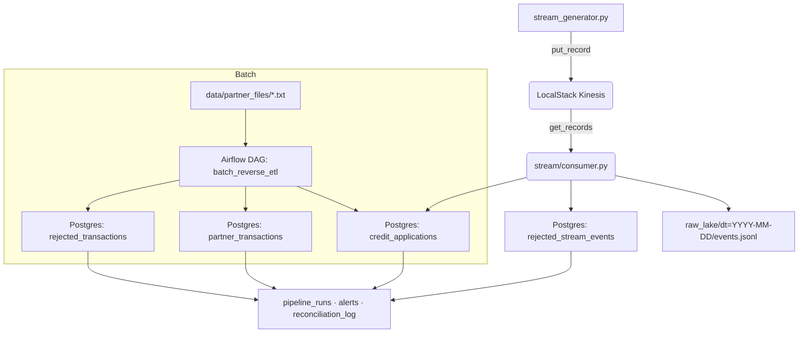

# Challenge SR Data Engineer — Quick Reference

Concise repo reference and start instructions for local development.

Prerequisites
- Python 3 (system), Docker, Docker Compose (or Docker Desktop).

Quick start
- Bootstrap the Python environment (optional):
  ```bash
  ./scripts/setup_env.sh
  ```
- Start the stack (Airflow, LocalStack, Postgres, consumer, generator):
  ```bash
  make up
  ```
- Tail logs or specific services:
  ```bash
  make logs            # all services
  make logs-consumer   # stream consumer only
  ```
- Run an ad-hoc generator or control its runtime:
  ```bash
  make generate SECONDS=60    # run generator 60s
  make generate EVENTS=100    # run until 100 events sent
  ```
- Manage the consumer:
  ```bash
  make start-consumer
  make stop-consumer
  make run-consumer   # foreground (debug)
  ```
- Inspect Kinesis without aws-cli:
  ```bash
  make kinesis-status
  ```

Architecture (mermaid)


Example message flow
- Example event (JSON):
  ```json
  {
    "application_id": "APP-123456",
    "customer_id": "CUST-2345",
    "requested_amount": 12500,
    "declared_income": 45000,
    "customer_age": 32,
    "timestamp": "2026-08-16T12:00:00Z"
  }
  ```
- Flow (concrete):
  1. `stream_generator.py` publishes the event to LocalStack Kinesis.
  2. `stream/consumer.py` polls Kinesis, appends raw JSON to `raw_lake/dt=.../events.jsonl`.
  3. Consumer validates the payload:
     - valid → idempotent upsert into `credit_applications`.
     - invalid → insert into `rejected_stream_events` with a reason.
  4. The `@audited` wrapper writes a `pipeline_runs` row for the poll batch (records_in/processed/rejected).

Monitoring & alerts (how executions are recorded)
- Tables used for observability:
  - `pipeline_runs`: per-run/poll audit (fields include `pipeline_name`, `task_name`, `started_at`, `ended_at`, `records_in`, `records_processed`, `records_rejected`, `status`).
  - `alerts`: proactive alerts (type, severity, metric_value, threshold, triggered_at).
  - `rejected_stream_events` / `rejected_transactions`: quarantined bad records with reason and timestamp.
- Where entries are created:
  - Stream consumer: each non-empty poll is wrapped by `@audited` and creates/updates a `pipeline_runs` entry; if rejection-rate ≥ configured threshold (default 15%), `raise_alert(...)` inserts an `alerts` row.
  - Batch DAG: each audited task writes `pipeline_runs`, and quarantines are written to `rejected_transactions` when DQ rules fail.
- Inspect runtime state:
  - `make kinesis-status` — shows stream summary and samples per shard (no aws CLI required).
  - `make logs-consumer` / `docker compose logs -f stream-consumer` — live consumer logs.
  - `make audit` / `make alerts` / `make rejected` — convenience targets to query governance tables.

Safe cleanup
- Truncate application data (keeps schemas + Airflow DB intact):
  ```bash
  make clean-app-data
  ```

Commands reference (most used)
- `make package` — bootstrap Python venv and install deps (`scripts/setup_env.sh`).
- `make up` — build and start full stack.
- `make generate SECONDS=60` — run the generator for 60 seconds.
- `make start-consumer` / `make stop-consumer` — manage consumer container.
- `make kinesis-status` — lightweight Kinesis inspection via boto3 + LocalStack.
- `make clean-app-data` — truncate application tables (interactive confirmation).

Where to look next
- `stream/consumer.py` — ingestion logic and auditing.
- `dags/batch_reverse_etl_dag.py` — batch ETL tasks.
- `common/audit.py` — auditing + alerting implementation.

If you want automated consumer checkpoints (per-shard sequence numbers) and a `make kinesis-lag` command to compute lag, I can add that next.
